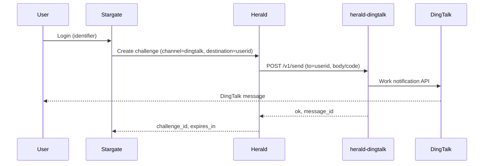

# herald-dingtalk

[](LICENSE)
[](https://golang.org)
[](https://goreportcard.com/report/github.com/soulteary/herald-dingtalk)

## Multi-language Documentation

- [English](README.md) | [中文](README.zhCN.md)

DingTalk notification adapter for [Herald](https://github.com/soulteary/herald). Herald forwards verification codes over HTTP to this service; herald-dingtalk calls the DingTalk work notification API to deliver messages. All DingTalk credentials and business logic live in this project only—Herald does not hold any DingTalk credentials.

## Core Features

- **Herald HTTP Provider contract**: Implements the same HTTP send contract as Herald's external provider (Claude.md 13.1); request/response align with [provider-kit](https://github.com/soulteary/provider-kit) `HTTPSendRequest` / `HTTPSendResponse`.
- **Optional API Key auth**: When `API_KEY` is set, Herald must send `X-API-Key`; otherwise no auth required.
- **Idempotency**: Supports `Idempotency-Key` (or body `idempotency_key`); same key within TTL returns cached result without calling DingTalk again.
- **Graceful shutdown**: On `SIGINT` or `SIGTERM`, server stops accepting new requests and shuts down with a 10s timeout.

## Architecture



- **Stargate**: ForwardAuth / login orchestration.
- **Herald**: OTP challenge creation and verification; calls herald-dingtalk for channel `dingtalk`.
- **herald-dingtalk**: HTTP adapter; calls DingTalk work notification API; holds DingTalk credentials only here.

## Protocol

- **POST /v1/send**  
  Request: `channel`, `to` (DingTalk userid), `body` (or `params.code`), `idempotency_key`, optional `template`/`params`/`locale`/`subject`.  
  Response: `{ "ok": true, "message_id": "...", "provider": "dingtalk" }` or `{ "ok": false, "error_code": "...", "error_message": "..." }`.
- **GET /healthz**: `{ "status": "healthy", "service": "herald-dingtalk" }` (via [health-kit](https://github.com/soulteary/health-kit)).

## Configuration

| Variable | Description | Default | Required |
|----------|-------------|---------|----------|
| `PORT` | Listen port (with or without leading colon) | `:8083` | No |
| `API_KEY` | If set, Herald must send `X-API-Key` | `` | No |
| `DINGTALK_APP_KEY` | DingTalk app key | `` | Yes (for send) |
| `DINGTALK_APP_SECRET` | DingTalk app secret | `` | Yes (for send) |
| `DINGTALK_AGENT_ID` | Agent ID for work notification | `` | Yes (for send) |
| `LOG_LEVEL` | Log level: trace, debug, info, warn, error | `info` | No |
| `IDEMPOTENCY_TTL_SECONDS` | Idempotency cache TTL (seconds) | `300` | No |

## Herald side

Configure Herald with HTTP provider for channel `dingtalk`:

- `HERALD_DINGTALK_API_URL` = base URL of herald-dingtalk (e.g. `http://herald-dingtalk:8083`)
- Optional: `HERALD_DINGTALK_API_KEY` = same as herald-dingtalk `API_KEY`

Herald does not hold any DingTalk credentials.

## Quick Start

### Build & run (binary)

```bash
go build -o herald-dingtalk .
./herald-dingtalk
```

With DingTalk credentials in env, `POST /v1/send` will send work notifications to the given userid.

### Run with Docker

```bash
docker build -t herald-dingtalk .
docker run -d --name herald-dingtalk -p 8083:8083 \
  -e DINGTALK_APP_KEY=your_app_key \
  -e DINGTALK_APP_SECRET=your_app_secret \
  -e DINGTALK_AGENT_ID=your_agent_id \
  herald-dingtalk
```

Optional: add `-e API_KEY=your_shared_secret` and set `HERALD_DINGTALK_API_KEY` to the same value on Herald.

## Documentation

- **[Documentation Index (English)](docs/enUS/README.md)** – [API](docs/enUS/API.md) | [Deployment](docs/enUS/DEPLOYMENT.md) | [Troubleshooting](docs/enUS/TROUBLESHOOTING.md) | [Security](docs/enUS/SECURITY.md)
- **[文档索引（中文）](docs/zhCN/README.md)** – [API](docs/zhCN/API.md) | [部署](docs/zhCN/DEPLOYMENT.md) | [故障排查](docs/zhCN/TROUBLESHOOTING.md) | [安全](docs/zhCN/SECURITY.md)

## Testing

```bash
go test ./...
```

Coverage:

```bash
go test -cover ./...
go test -coverprofile=coverage.out ./...
go tool cover -func=coverage.out
go tool cover -html=coverage.out
```

Current coverage: `internal/config` (ValidWith), `internal/idempotency` (NewStore/Get/Set). Handler, router, and dingtalk client are not yet covered by unit tests.

## Operation

- **Graceful shutdown**: On `SIGINT` or `SIGTERM`, the server stops accepting new requests and shuts down with a 10s timeout. Logs `"shutting down"` and any shutdown error.
- **Logging**: Structured JSON logs via [logger-kit](https://github.com/soulteary/logger-kit). Key events: send ok (to, message_id), send_failed (err, to), unauthorized, invalid_destination, idempotent hit (debug), 503 provider_down. Set `LOG_LEVEL` to `debug` for idempotent hits.

## License

See [LICENSE](LICENSE) for details.
