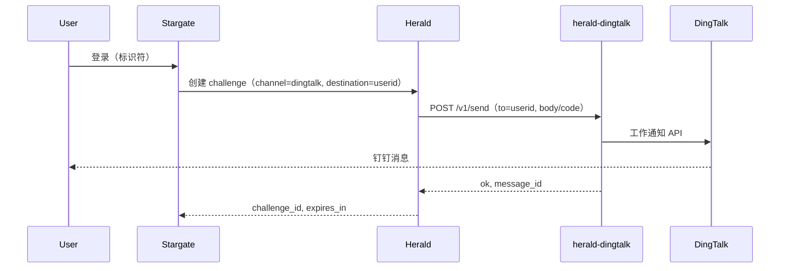

# herald-dingtalk

[](LICENSE)
[](https://golang.org)
[](https://goreportcard.com/report/github.com/soulteary/herald-dingtalk)

## 多语言文档

- [English](README.md) | [中文](README.zhCN.md)

herald-dingtalk 是 [Herald](https://github.com/soulteary/herald) 的钉钉通知适配器。Herald 通过 HTTP 将验证码请求转发到本服务，本服务再调用钉钉工作通知 API 下发消息。所有钉钉凭证与业务逻辑仅存在于本项目中，Herald 不保存任何钉钉凭证。

## 核心特性

- **与 Herald HTTP Provider 协议一致**：实现 Herald 外部 Provider 的 HTTP 发送契约（Claude.md 13.1），请求/响应与 [provider-kit](https://github.com/soulteary/provider-kit) 的 `HTTPSendRequest` / `HTTPSendResponse` 对齐。
- **可选 API Key 鉴权**：配置 `API_KEY` 后，Herald 需在请求头中携带 `X-API-Key`；未配置则无需鉴权。
- **幂等**：支持 `Idempotency-Key`（或 body 中的 `idempotency_key`），TTL 内相同 key 直接返回缓存结果，不再调用钉钉。
- **优雅关闭**：收到 `SIGINT` 或 `SIGTERM` 后停止接收新请求，并在 10 秒超时内完成关闭。

## 架构



- **Stargate**：ForwardAuth / 登录编排。
- **Herald**：OTP challenge 创建与校验；对 channel `dingtalk` 调用 herald-dingtalk。
- **herald-dingtalk**：HTTP 适配层；调用钉钉工作通知 API；仅在本服务持有钉钉凭证。

## 协议

- **POST /v1/send**  
  请求：`channel`、`to`（钉钉 userid）、`body`（或 `params.code`）、`idempotency_key`，可选 `template`/`params`/`locale`/`subject`。  
  响应：`{ "ok": true, "message_id": "...", "provider": "dingtalk" }` 或 `{ "ok": false, "error_code": "...", "error_message": "..." }`。
- **GET /healthz**：`{ "status": "healthy", "service": "herald-dingtalk" }`（通过 [health-kit](https://github.com/soulteary/health-kit)）。

## 配置

| 变量 | 说明 | 默认值 | 必填 |
|------|------|--------|------|
| `PORT` | 监听端口（可带或不带冒号） | `:8083` | 否 |
| `API_KEY` | 若设置，Herald 需在请求头中携带 `X-API-Key` | `` | 否 |
| `DINGTALK_APP_KEY` | 钉钉应用 AppKey | `` | 是（发送时） |
| `DINGTALK_APP_SECRET` | 钉钉应用 AppSecret | `` | 是（发送时） |
| `DINGTALK_AGENT_ID` | 工作通知使用的 AgentID | `` | 是（发送时） |
| `LOG_LEVEL` | 日志级别：trace, debug, info, warn, error | `info` | 否 |
| `IDEMPOTENCY_TTL_SECONDS` | 幂等缓存 TTL（秒） | `300` | 否 |

## Herald 侧配置

在 Herald 中为 channel `dingtalk` 配置 HTTP Provider：

- `HERALD_DINGTALK_API_URL` = herald-dingtalk 的 Base URL（例如 `http://herald-dingtalk:8083`）
- 可选：`HERALD_DINGTALK_API_KEY` = 与 herald-dingtalk 的 `API_KEY` 相同

Herald 不保存任何钉钉凭证。

## 快速开始

### 构建与运行（二进制）

```bash
go build -o herald-dingtalk .
./herald-dingtalk
```

在环境变量中配置钉钉凭证后，`POST /v1/send` 会向指定 userid 发送工作通知。

### 使用 Docker 运行

```bash
docker build -t herald-dingtalk .
docker run -d --name herald-dingtalk -p 8083:8083 \
  -e DINGTALK_APP_KEY=your_app_key \
  -e DINGTALK_APP_SECRET=your_app_secret \
  -e DINGTALK_AGENT_ID=your_agent_id \
  herald-dingtalk
```

可选：增加 `-e API_KEY=your_shared_secret`，并在 Herald 侧将 `HERALD_DINGTALK_API_KEY` 设为相同值。

## 文档

- **[Documentation Index (English)](docs/enUS/README.md)** – [API](docs/enUS/API.md) | [Deployment](docs/enUS/DEPLOYMENT.md) | [Troubleshooting](docs/enUS/TROUBLESHOOTING.md) | [Security](docs/enUS/SECURITY.md)
- **[文档索引（中文）](docs/zhCN/README.md)** – [API](docs/zhCN/API.md) | [部署](docs/zhCN/DEPLOYMENT.md) | [故障排查](docs/zhCN/TROUBLESHOOTING.md) | [安全](docs/zhCN/SECURITY.md)

## 测试

```bash
go test ./...
```

覆盖率：

```bash
go test -cover ./...
go test -coverprofile=coverage.out ./...
go tool cover -func=coverage.out
go tool cover -html=coverage.out
```

当前覆盖：`internal/config`（ValidWith）、`internal/idempotency`（NewStore/Get/Set）。Handler、router、dingtalk client 尚未有单元测试覆盖。

## 运维

- **优雅关闭**：收到 `SIGINT` 或 `SIGTERM` 后停止接收新请求，在 10 秒超时内完成关闭。会打印 `"shutting down"` 及关闭过程中的错误。
- **日志**：通过 [logger-kit](https://github.com/soulteary/logger-kit) 输出结构化 JSON 日志。关键事件：send ok（to, message_id）、send_failed（err, to）、unauthorized、invalid_destination、idempotent hit（debug）、503 provider_down。需要查看幂等命中时可将 `LOG_LEVEL` 设为 `debug`。

## 许可证

详见 [LICENSE](LICENSE)。
