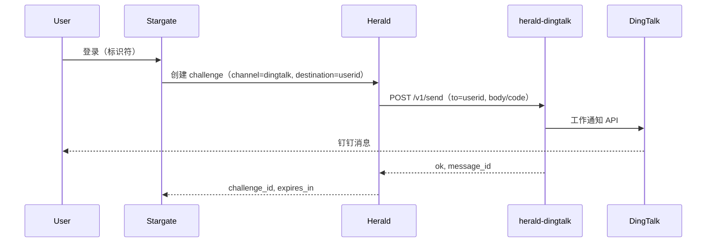

# herald-dingtalk

[](LICENSE)
[](https://golang.org)
[](https://goreportcard.com/report/github.com/soulteary/herald-dingtalk)

## 多语言文档

- [English](README.md) | [中文](README.zhCN.md)

herald-dingtalk 是 [Herald](https://github.com/soulteary/herald) 的钉钉通知适配器。Herald 通过 HTTP 将验证码请求转发到本服务，本服务再调用钉钉工作通知 API 下发消息。所有钉钉凭证与业务逻辑仅存在于本项目中，Herald 不保存任何钉钉凭证。

HTTP 服务使用 Fiber v3.5.0 及与之匹配的 Fiber 相关 kit v2 模块版本。从源码构建需要 Go 1.26 或更高版本。

## 核心特性

- **与 Herald HTTP Provider 协议一致**：实现 Herald 外部 Provider 的 HTTP 发送契约，请求/响应与 [provider-kit](https://github.com/soulteary/provider-kit) 的 `HTTPSendRequest` / `HTTPSendResponse` 对齐。
- **可选 API Key 鉴权**：配置 `API_KEY` 后，Herald 需在请求头中携带 `X-API-Key`；未配置则无需鉴权。
- **幂等**：合并相同 key 的并发请求，并在 TTL 内缓存成功结果；同一 key 对应不同发送内容时返回 `409 idempotency_conflict`。
- **优雅关闭**：收到 `SIGINT` 或 `SIGTERM` 后停止接收新请求，并在 35 秒超时内完成关闭。
- **服务边界加固**：API Key 固定时长校验、请求体限制、HTTP 超时、请求 ID、安全响应头和 panic 恢复。

## 架构


```mermaid
sequenceDiagram
  participant User
  participant Stargate
  participant Herald
  participant HeraldDingtalk as herald-dingtalk
  participant DingTalk

  User->>Stargate: 登录（标识符）
  Stargate->>Herald: 创建 challenge（channel=dingtalk, destination=userid）
  Herald->>HeraldDingtalk: POST /v1/send（to=userid, body/code）
  HeraldDingtalk->>DingTalk: 工作通知 API
  DingTalk-->>User: 钉钉消息
  HeraldDingtalk-->>Herald: ok, message_id
  Herald-->>Stargate: challenge_id, expires_in
```

- **Stargate**：ForwardAuth / 登录编排。
- **Herald**：OTP challenge 创建与校验；对 channel `dingtalk` 调用 herald-dingtalk。
- **herald-dingtalk**：HTTP 适配层；调用钉钉工作通知 API；仅在本服务持有钉钉凭证。

## 协议

- **POST /v1/resolve**（可选）  
  将钉钉 OAuth2 授权码 `auth_code` 兑换为 **userid**。请求：`{ "auth_code": "..." }`。响应：`{ "ok": true, "userid": "..." }` 或错误。详见 [API](docs/zhCN/API.md#解析-oauth2-授权码可选)。
- **POST /v1/send**  
  请求：`channel`（传入时必须为 `dingtalk`）、`to`（钉钉 **userid**，或当 `DINGTALK_LOOKUP_MODE=mobile` 时为 11 位**手机号**）、`body`（或 `params.code`）、`idempotency_key`，可选 `template`/`params`/`locale`/`subject`/`timeout_seconds`（0–30）。  
  响应：`{ "ok": true, "message_id": "...", "provider": "dingtalk" }` 或 `{ "ok": false, "error_code": "...", "error_message": "..." }`。
- **GET /healthz**：`{ "status": "healthy", "service": "herald-dingtalk" }`（通过 [health-kit](https://github.com/soulteary/health-kit)）。
- **GET /readyz**：仅在凭证完整、`DINGTALK_AGENT_ID` 为正整数且查询模式受支持时返回 `200`，否则返回 `503`。

## 配置

| 变量 | 说明 | 默认值 | 必填 |
|------|------|--------|------|
| `PORT` | 监听端口（可带或不带冒号） | `:8083` | 否 |
| `API_KEY` | 若设置，Herald 需在请求头中携带 `X-API-Key` | `` | 否 |
| `DINGTALK_APP_KEY` | 钉钉应用 AppKey | `` | 是（发送时） |
| `DINGTALK_APP_SECRET` | 钉钉应用 AppSecret | `` | 是（发送时） |
| `DINGTALK_AGENT_ID` | 工作通知使用的十进制正整数 AgentID | `` | 是（发送时） |
| `DINGTALK_LOOKUP_MODE` | 只能为 `none`（仅 userid）或 `mobile`（userid 或 11 位手机号，需申请 Contact.User.mobile 权限） | `none` | 否 |
| `LOG_LEVEL` | 日志级别：trace, debug, info, warn, error | `info` | 否 |
| `IDEMPOTENCY_TTL_SECONDS` | 幂等缓存 TTL（秒） | `300` | 否 |
| `MAX_REQUEST_BODY_BYTES` | HTTP 请求体上限，有效范围为 1 字节至 1 MiB | `65536` | 否 |
| `MAX_CONCURRENT_REQUESTS` | 每个进程允许的 `/v1` 并发请求上限；`0` 表示禁用 | `32` | 否 |

## Herald 侧配置

在 Herald 中为 channel `dingtalk` 配置 HTTP Provider：

- `HERALD_DINGTALK_API_URL` = herald-dingtalk 的 Base URL（例如 `http://herald-dingtalk:8083`）
- 可选：`HERALD_DINGTALK_API_KEY` = 与 herald-dingtalk 的 `API_KEY` 相同

Herald 不保存任何钉钉凭证。

## 快速开始

### 构建与运行（二进制）

```bash
go build -o herald-dingtalk .
./herald-dingtalk
```

使用 `./herald-dingtalk --version` 可输出构建时注入的版本号。

在环境变量中配置钉钉凭证后，`POST /v1/send` 会向指定 userid 发送工作通知。

### 使用 Docker 运行

```bash
docker build -t herald-dingtalk .
docker run -d --name herald-dingtalk -p 8083:8083 \
  -e DINGTALK_APP_KEY=your_app_key \
  -e DINGTALK_APP_SECRET=your_app_secret \
  -e DINGTALK_AGENT_ID=your_agent_id \
  herald-dingtalk
```

可选：增加 `-e API_KEY=your_shared_secret`，并在 Herald 侧将 `HERALD_DINGTALK_API_KEY` 设为相同值。

## 文档

- **[Documentation Index (English)](docs/enUS/README.md)** – [API](docs/enUS/API.md) | [Deployment](docs/enUS/DEPLOYMENT.md) | [Operations](docs/enUS/OPERATIONS.md) | [Troubleshooting](docs/enUS/TROUBLESHOOTING.md) | [Security](docs/enUS/SECURITY.md)
- **[文档索引（中文）](docs/zhCN/README.md)** – [API](docs/zhCN/API.md) | [部署](docs/zhCN/DEPLOYMENT.md) | [运维](docs/zhCN/OPERATIONS.md) | [故障排查](docs/zhCN/TROUBLESHOOTING.md) | [安全](docs/zhCN/SECURITY.md)

## 测试

```bash
go test ./...
```

覆盖率：

```bash
go test -cover ./...
go test -coverprofile=coverage.out ./...
go tool cover -func=coverage.out
go tool cover -html=coverage.out
```

测试覆盖配置校验、幂等与并发行为、钉钉成功及异常响应、请求处理器、鉴权、路由、可观测性和优雅关闭。CI 要求总语句覆盖率不低于 90%。静态检查：`golangci-lint run`。

## 运维

- **优雅关闭**：收到 `SIGINT` 或 `SIGTERM` 后停止接收新请求，在 35 秒超时内完成关闭。会打印 `"shutting down"` 及关闭过程中的错误。
- **探针**：`/healthz` 用于存活检查，`/readyz` 用于就绪检查；钉钉凭证未配置完整时就绪探针返回 `503`。
- **HTTP 边界**：响应包含 `X-Request-ID` 和安全响应头；请求体默认限制为 64 KiB，读取、写入和空闲超时分别为 10、35 和 60 秒。
- **日志**：通过 [logger-kit](https://github.com/soulteary/logger-kit) 输出结构化 JSON 日志，不记录接收者标识、手机号、userid、OAuth 授权码、API Key 或请求体。
- **容器**：运行时镜像内置 Docker 健康检查，并使用非特权 `herald` 用户运行。
- **钉钉客户端保护**：合并并发 Token 刷新；Token 被明确拒绝时仅刷新重试一次；拒绝非 2xx 响应；响应体限制为 1 MiB。

## 许可证

详见 [LICENSE](LICENSE)。
