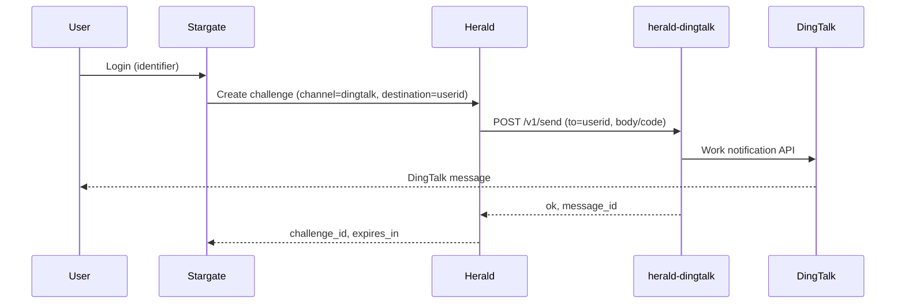

# herald-dingtalk Deployment Guide

## Quick Start

### Binary

```bash
# Build
go build -o herald-dingtalk .

# Run (set DingTalk env vars first)
./herald-dingtalk
```

### Docker

```bash
# Build image
docker build -t herald-dingtalk .

# Run with env vars
docker run -d --name herald-dingtalk -p 8083:8083 \
  -e DINGTALK_APP_KEY=your_app_key \
  -e DINGTALK_APP_SECRET=your_app_secret \
  -e DINGTALK_AGENT_ID=your_agent_id \
  herald-dingtalk
```

Optional: if you use `API_KEY` on herald-dingtalk, pass it and use the same value in Herald as `HERALD_DINGTALK_API_KEY`:

```bash
docker run -d --name herald-dingtalk -p 8083:8083 \
  -e API_KEY=your_shared_secret \
  -e DINGTALK_APP_KEY=your_app_key \
  -e DINGTALK_APP_SECRET=your_app_secret \
  -e DINGTALK_AGENT_ID=your_agent_id \
  herald-dingtalk
```

### Docker Compose (example)

Minimal example for herald-dingtalk only:

```yaml
services:
  herald-dingtalk:
    image: herald-dingtalk:latest
    build: .
    ports:
      - "8083:8083"
    environment:
      - PORT=:8083
      - DINGTALK_APP_KEY=${DINGTALK_APP_KEY}
      - DINGTALK_APP_SECRET=${DINGTALK_APP_SECRET}
      - DINGTALK_AGENT_ID=${DINGTALK_AGENT_ID}
      # Optional:
      # - API_KEY=${API_KEY}
      # - LOG_LEVEL=info
      # - IDEMPOTENCY_TTL_SECONDS=300
```

## Configuration

### Environment Variables

| Variable | Description | Default | Required |
|----------|-------------|---------|----------|
| `PORT` | Listen port (with or without leading colon, e.g. `8083` or `:8083`) | `:8083` | No |
| `API_KEY` | If set, callers must send `X-API-Key` with this value | `` | No |
| `DINGTALK_APP_KEY` | DingTalk app key (from DingTalk open platform) | `` | Yes (for send) |
| `DINGTALK_APP_SECRET` | DingTalk app secret | `` | Yes (for send) |
| `DINGTALK_AGENT_ID` | Agent ID for work notification | `` | Yes (for send) |
| `LOG_LEVEL` | Log level: trace, debug, info, warn, error | `info` | No |
| `IDEMPOTENCY_TTL_SECONDS` | Idempotency cache TTL in seconds | `300` | No |

When any of `DINGTALK_APP_KEY`, `DINGTALK_APP_SECRET`, or `DINGTALK_AGENT_ID` is missing, `POST /v1/send` returns `503` with `error_code: "provider_down"`.

## Integration with Herald

Herald calls herald-dingtalk over HTTP when the OTP channel is `dingtalk`. Configure Herald with:

- **`HERALD_DINGTALK_API_URL`** – Base URL of herald-dingtalk (e.g. `http://herald-dingtalk:8083`).
- **`HERALD_DINGTALK_API_KEY`** (optional) – Same value as herald-dingtalk `API_KEY`; Herald will send it as `X-API-Key`.

Herald does not store any DingTalk credentials; all DingTalk credentials live only in herald-dingtalk.

### Data flow



High-level architecture:

- **Stargate**: ForwardAuth / login orchestration.
- **Herald**: OTP challenge creation and verification; calls herald-dingtalk for `dingtalk` channel.
- **herald-dingtalk**: HTTP adapter; calls DingTalk work notification API; holds DingTalk credentials.

## DingTalk Setup

To use herald-dingtalk you need a DingTalk enterprise internal application with “work notification” capability.

1. **Open DingTalk Open Platform**  
   [https://open.dingtalk.com](https://open.dingtalk.com) – use your enterprise account.

2. **Create an internal application**  
   Application Management → Create Application → Internal Development. Fill in name and description.

3. **Get AppKey and AppSecret**  
   In the application details, copy **AppKey** and **AppSecret** → set as `DINGTALK_APP_KEY` and `DINGTALK_APP_SECRET`.

4. **Add application agent and get AgentID**  
   In the same application, open “Features and permissions” (or “Application agent”). Add an agent if needed, then copy the **AgentID** → set as `DINGTALK_AGENT_ID`.

5. **Permissions and visibility**  
   Ensure the app has permission to send work notifications and that the target users are within the app’s visible range. The `to` field in `/v1/send` must be the DingTalk **userid** (not mobile/email); userid can be obtained from DingTalk API or admin backend.

For official details, see [DingTalk Work Notification (Corp Conversation)](https://open.dingtalk.com/document/orgapp/asynchronous-sending-of-enterprise-session-messages).
