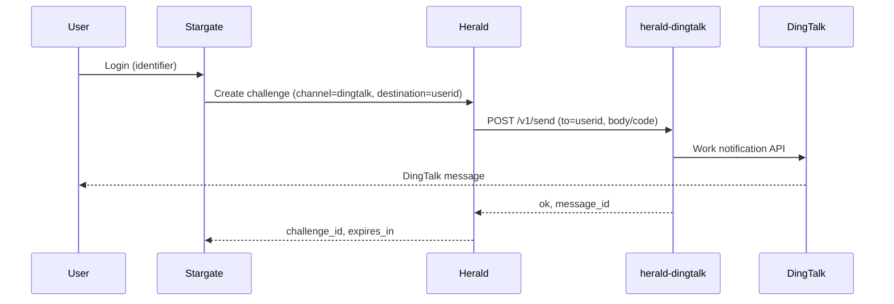

# herald-dingtalk Deployment Guide

For production rollout, Kubernetes, probes, scaling, and incident triage, also see [OPERATIONS.md](OPERATIONS.md).

## Quick Start

### Binary

Download a release binary and `checksums.txt` from [GitHub Releases](https://github.com/soulteary/herald-dingtalk/releases):

```bash
curl -LO https://github.com/soulteary/herald-dingtalk/releases/download/v1.0.0/herald-dingtalk-linux-amd64
curl -LO https://github.com/soulteary/herald-dingtalk/releases/download/v1.0.0/checksums.txt
grep 'herald-dingtalk-linux-amd64$' checksums.txt | sha256sum -c -
chmod +x herald-dingtalk-linux-amd64
./herald-dingtalk-linux-amd64 --version
# 1.0.0
```

Release binaries are also available for Linux ARM64, macOS AMD64/ARM64, and Windows AMD64/ARM64. Building from source requires Go 1.26.6 or later:

```bash
# Build
go build -o herald-dingtalk .

# Run (set DingTalk env vars first)
./herald-dingtalk
```

### Docker

```bash
# Pull a versioned release image
docker pull ghcr.io/soulteary/herald-dingtalk:v1.0.0

# Run with env vars
docker run -d --name herald-dingtalk -p 8083:8083 \
  -e DINGTALK_APP_KEY=your_app_key \
  -e DINGTALK_APP_SECRET=your_app_secret \
  -e DINGTALK_AGENT_ID=your_agent_id \
  ghcr.io/soulteary/herald-dingtalk:v1.0.0
```

Optional: if you use `API_KEY` on herald-dingtalk, pass it and use the same value in Herald as `HERALD_DINGTALK_API_KEY`:

```bash
docker run -d --name herald-dingtalk -p 8083:8083 \
  -e API_KEY=your_shared_secret \
  -e DINGTALK_APP_KEY=your_app_key \
  -e DINGTALK_APP_SECRET=your_app_secret \
  -e DINGTALK_AGENT_ID=your_agent_id \
  ghcr.io/soulteary/herald-dingtalk:v1.0.0
```

For a local source build, use `docker build -t herald-dingtalk:local .` and substitute that image name in the commands above.

### Docker Compose (example)

Minimal example for herald-dingtalk only:

```yaml
services:
  herald-dingtalk:
    image: ghcr.io/soulteary/herald-dingtalk:v1.0.0
    ports:
      - "8083:8083"
    environment:
      - PORT=:8083
      - DINGTALK_APP_KEY=${DINGTALK_APP_KEY}
      - DINGTALK_APP_SECRET=${DINGTALK_APP_SECRET}
      - DINGTALK_AGENT_ID=${DINGTALK_AGENT_ID}
      # Optional:
      # - API_KEY=${API_KEY}
      # - LOG_LEVEL=info
      # - IDEMPOTENCY_TTL_SECONDS=300
      # - MAX_REQUEST_BODY_BYTES=65536
      # - MAX_CONCURRENT_REQUESTS=32
```

## Configuration

### Environment Variables

| Variable | Description | Default | Required |
|----------|-------------|---------|----------|
| `PORT` | Listen port (with or without leading colon, e.g. `8083` or `:8083`) | `:8083` | No |
| `API_KEY` | If set, callers must send `X-API-Key` with this value | `` | No |
| `DINGTALK_APP_KEY` | DingTalk app key (from DingTalk open platform) | `` | Yes (for send) |
| `DINGTALK_APP_SECRET` | DingTalk app secret | `` | Yes (for send) |
| `DINGTALK_AGENT_ID` | Positive base-10 Agent ID for work notification | `` | Yes (for send) |
| `DINGTALK_LOOKUP_MODE` | Must be `none` (userid only) or `mobile` (userid or 11-digit mobile; requires Contact.User.mobile permission) | `none` | No |
| `LOG_LEVEL` | Log level: trace, debug, info, warn, error | `info` | No |
| `IDEMPOTENCY_TTL_SECONDS` | Idempotency cache TTL in seconds | `300` | No |
| `MAX_REQUEST_BODY_BYTES` | Maximum HTTP request body size; values above 1 MiB or non-positive values use the default | `65536` | No |
| `MAX_CONCURRENT_REQUESTS` | Maximum in-flight `/v1` requests per process; excess requests receive `429` with `Retry-After: 1`; `0` disables the limit | `32` | No |

When a credential is missing or has surrounding whitespace, `DINGTALK_AGENT_ID` is not a positive integer, or `DINGTALK_LOOKUP_MODE` is unsupported, both provider endpoints return `503` with `error_code: "provider_down"`. The startup warning identifies the invalid variable without printing credential values.

Use `GET /healthz` as the liveness probe and `GET /readyz` as the readiness probe. The container image runs as a non-root user and includes a Docker health check against `/healthz`.

Every request emits a structured access log with method, path, status, latency, client metadata, and `request_id`. A caller-provided `X-Request-ID` is propagated; otherwise the service generates one and returns it in the response. Headers, query strings, and request bodies are deliberately excluded from access logs.

On `SIGINT` or `SIGTERM`, the listener stops accepting new connections and waits up to 35 seconds for in-flight requests. This shutdown budget exceeds the maximum accepted 30-second request timeout. Listener failures are returned to the main goroutine and cause a non-zero process exit instead of terminating from a background goroutine.

## Integration with Herald

Herald calls herald-dingtalk over HTTP when the OTP channel is `dingtalk`. Configure Herald with:

- **`HERALD_DINGTALK_API_URL`** – Base URL of herald-dingtalk (e.g. `http://herald-dingtalk:8083`).
- **`HERALD_DINGTALK_API_KEY`** (optional) – Same value as herald-dingtalk `API_KEY`; Herald will send it as `X-API-Key`.

Herald does not store any DingTalk credentials; all DingTalk credentials live only in herald-dingtalk.

### Data flow


```mermaid
sequenceDiagram
  participant User
  participant Stargate
  participant Herald
  participant HeraldDingtalk as herald-dingtalk
  participant DingTalk

  User->>Stargate: Login (identifier)
  Stargate->>Herald: Create challenge (channel=dingtalk, destination=userid)
  Herald->>HeraldDingtalk: POST /v1/send (to=userid, body/code)
  HeraldDingtalk->>DingTalk: Work notification API
  DingTalk-->>User: DingTalk message
  HeraldDingtalk-->>Herald: ok, message_id
  Herald-->>Stargate: challenge_id, expires_in
```

High-level architecture:

- **Stargate**: ForwardAuth / login orchestration.
- **Herald**: OTP challenge creation and verification; calls herald-dingtalk for `dingtalk` channel.
- **herald-dingtalk**: HTTP adapter; calls DingTalk work notification API; holds DingTalk credentials.

## DingTalk Setup

To use herald-dingtalk you need a DingTalk enterprise internal application with “work notification” capability.

1. **Open DingTalk Open Platform**  
   [https://open.dingtalk.com](https://open.dingtalk.com) – use your enterprise account.

2. **Create an internal application**  
   Application Management → Create Application → Internal Development. Fill in name and description.

3. **Get AppKey and AppSecret**  
   In the application details, copy **AppKey** and **AppSecret** → set as `DINGTALK_APP_KEY` and `DINGTALK_APP_SECRET`.

4. **Add application agent and get AgentID**  
   In the same application, open “Features and permissions” (or “Application agent”). Add an agent if needed, then copy the **AgentID** → set as `DINGTALK_AGENT_ID`.

5. **Permissions and visibility**  
   Ensure the app has permission to send work notifications and that the target users are within the app’s visible range. By default, `to` in `/v1/send` must be DingTalk **userid**. If you set `DINGTALK_LOOKUP_MODE=mobile`, `to` can be an 11-digit mobile; you must then apply for **Contact.User.mobile** (query user by mobile) in the DingTalk open platform. userid can also be obtained via DingTalk API, `/v1/resolve` after OAuth2 callback, or admin backend.

6. **Template messages do not apply to enterprise internal apps**  
   DingTalk states that **template messages (e.g. sendbytemplate) are only for third-party enterprise apps, not for enterprise internal apps.** This service uses an enterprise internal app + work notification (text message); template messages are not used. Do not assume sendbytemplate is required.

For official details, see [DingTalk Work Notification (Corp Conversation)](https://open.dingtalk.com/document/orgapp/asynchronous-sending-of-enterprise-session-messages).
