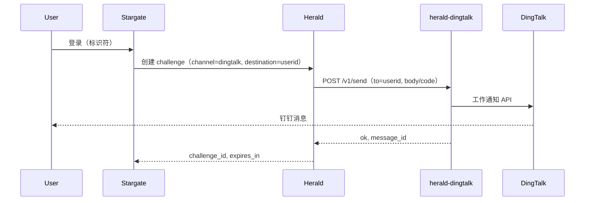

# herald-dingtalk 部署指南

## 快速开始

### 二进制

```bash
# 构建
go build -o herald-dingtalk .

# 运行（需先设置钉钉相关环境变量）
./herald-dingtalk
```

### Docker

```bash
# 构建镜像
docker build -t herald-dingtalk .

# 使用环境变量运行
docker run -d --name herald-dingtalk -p 8083:8083 \
  -e DINGTALK_APP_KEY=your_app_key \
  -e DINGTALK_APP_SECRET=your_app_secret \
  -e DINGTALK_AGENT_ID=your_agent_id \
  herald-dingtalk
```

若使用 `API_KEY`，需一并传入，并在 Herald 侧配置相同的 `HERALD_DINGTALK_API_KEY`：

```bash
docker run -d --name herald-dingtalk -p 8083:8083 \
  -e API_KEY=your_shared_secret \
  -e DINGTALK_APP_KEY=your_app_key \
  -e DINGTALK_APP_SECRET=your_app_secret \
  -e DINGTALK_AGENT_ID=your_agent_id \
  herald-dingtalk
```

### Docker Compose 示例

仅启动 herald-dingtalk 的最小示例：

```yaml
services:
  herald-dingtalk:
    image: herald-dingtalk:latest
    build: .
    ports:
      - "8083:8083"
    environment:
      - PORT=:8083
      - DINGTALK_APP_KEY=${DINGTALK_APP_KEY}
      - DINGTALK_APP_SECRET=${DINGTALK_APP_SECRET}
      - DINGTALK_AGENT_ID=${DINGTALK_AGENT_ID}
      # 可选：
      # - API_KEY=${API_KEY}
      # - LOG_LEVEL=info
      # - IDEMPOTENCY_TTL_SECONDS=300
```

## 配置

### 环境变量

| 变量 | 说明 | 默认值 | 必填 |
|------|------|--------|------|
| `PORT` | 监听端口（可带或不带冒号，如 `8083` 或 `:8083`） | `:8083` | 否 |
| `API_KEY` | 若设置，调用方必须在请求头中携带 `X-API-Key` 且与此一致 | `` | 否 |
| `DINGTALK_APP_KEY` | 钉钉应用 AppKey（来自钉钉开放平台） | `` | 是（发送时） |
| `DINGTALK_APP_SECRET` | 钉钉应用 AppSecret | `` | 是（发送时） |
| `DINGTALK_AGENT_ID` | 工作通知使用的 AgentID | `` | 是（发送时） |
| `LOG_LEVEL` | 日志级别：trace, debug, info, warn, error | `info` | 否 |
| `IDEMPOTENCY_TTL_SECONDS` | 幂等缓存 TTL（秒） | `300` | 否 |

当 `DINGTALK_APP_KEY`、`DINGTALK_APP_SECRET`、`DINGTALK_AGENT_ID` 任一未设置时，`POST /v1/send` 会返回 503，`error_code` 为 `provider_down`。

## 与 Herald 集成

当 OTP 通道为 `dingtalk` 时，Herald 通过 HTTP 调用 herald-dingtalk。在 Herald 侧配置：

- **`HERALD_DINGTALK_API_URL`**：herald-dingtalk 的 Base URL（例如 `http://herald-dingtalk:8083`）。
- **`HERALD_DINGTALK_API_KEY`**（可选）：与 herald-dingtalk 的 `API_KEY` 相同；Herald 会将其放在 `X-API-Key` 头中发送。

Herald 不保存任何钉钉凭证；所有钉钉凭证仅存在于 herald-dingtalk 中。

### 数据流



角色简述：

- **Stargate**：ForwardAuth / 登录编排。
- **Herald**：OTP challenge 创建与校验；对 `dingtalk` 通道调用 herald-dingtalk。
- **herald-dingtalk**：HTTP 适配层；调用钉钉工作通知 API；持有钉钉凭证。

## 钉钉侧准备

使用 herald-dingtalk 前，需要在钉钉开放平台创建具备「工作通知」能力的企业内部应用。

1. **打开钉钉开放平台**  
   [https://open.dingtalk.com](https://open.dingtalk.com)，使用企业账号登录。

2. **创建企业内部应用**  
   应用管理 → 创建应用 → 企业内部开发，填写名称与描述。

3. **获取 AppKey 与 AppSecret**  
   在应用详情中复制 **AppKey** 和 **AppSecret**，对应配置为 `DINGTALK_APP_KEY` 和 `DINGTALK_APP_SECRET`。

4. **添加应用 Agent 并获取 AgentID**  
   在同一应用下进入「功能与权限」或「应用 Agent」，添加 Agent 后复制 **AgentID**，对应配置为 `DINGTALK_AGENT_ID`。

5. **权限与可见范围**  
   确保应用具备发送工作通知的权限，且目标用户在应用的可见范围内。`/v1/send` 的 `to` 字段必须是钉钉 **userid**（非手机号/邮箱）；userid 可通过钉钉 API 或管理后台获取。

官方说明见 [钉钉工作通知（企业会话消息）](https://open.dingtalk.com/document/orgapp/asynchronous-sending-of-enterprise-session-messages)。
