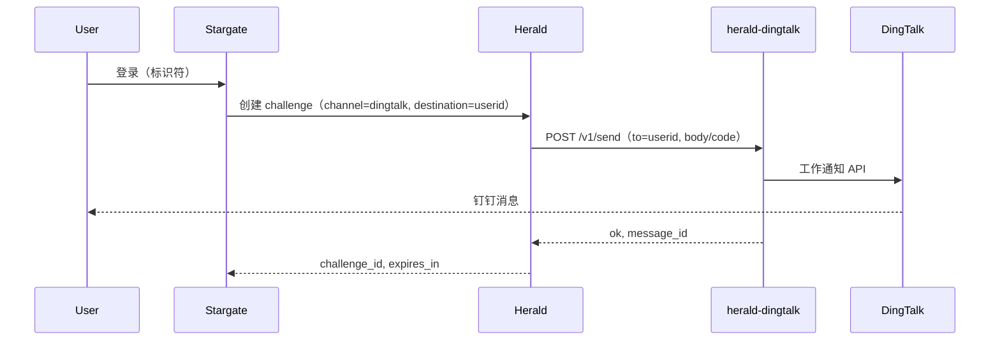

# herald-dingtalk 部署指南

本文描述如何以二进制、Docker 或 Docker Compose 方式部署 herald-dingtalk，以及配置说明、与 Herald 的集成和钉钉侧准备。

## 前置要求

- **运行环境**：Linux / macOS / Windows（推荐 Linux 生产环境）。
- **本地构建**：Go 1.25 或更高版本（参见 [go.mod](../go.mod)）。
- **钉钉应用**：在钉钉开放平台已创建具备「工作通知」能力的企业内部应用，并获取 AppKey、AppSecret、AgentID。详见本文 [钉钉侧准备](#钉钉侧准备)。

---

## 一、二进制部署

### 1.1 构建

在项目根目录执行：

```bash
go build -o herald-dingtalk .
```

可选：注入版本信息（需 [version-kit](https://github.com/soulteary/version-kit) 等）：

```bash
go build -ldflags "-w -s -X 'github.com/soulteary/version-kit.Version=v1.0.0' -X 'github.com/soulteary/version-kit.Commit=$(git rev-parse --short HEAD)'" -o herald-dingtalk .
```

### 1.2 运行

需先设置钉钉相关环境变量（见下方 [配置](#配置)）。可直接在 shell 中导出，或使用 `.env` 文件（需自行 `export` 或配合 `env` 使用，本程序不自动加载 `.env`）。

```bash
# 使用环境变量
export DINGTALK_APP_KEY=your_app_key
export DINGTALK_APP_SECRET=your_app_secret
export DINGTALK_AGENT_ID=your_agent_id
./herald-dingtalk
```

或指定端口：

```bash
export PORT=:8083
./herald-dingtalk
```

若未设置钉钉凭证，服务仍会启动，但 `POST /v1/send` 与 `POST /v1/resolve` 将返回 503（`provider_down`），便于先部署再配置凭证。

---

## 二、Docker 部署

### 2.1 构建镜像

在项目根目录（含 `Dockerfile`、`go.mod`、`go.sum`）执行：

```bash
docker build -t herald-dingtalk:latest .
```

可选构建参数（用于版本信息）：

```bash
docker build \
  --build-arg VERSION=v1.0.0 \
  --build-arg COMMIT=$(git rev-parse --short HEAD) \
  --build-arg BUILD_DATE=$(date +%FT%T%z) \
  -t herald-dingtalk:latest .
```

### 2.2 运行容器

仅钉钉凭证（最小可用）：

```bash
docker run -d --name herald-dingtalk -p 8083:8083 \
  -e DINGTALK_APP_KEY=your_app_key \
  -e DINGTALK_APP_SECRET=your_app_secret \
  -e DINGTALK_AGENT_ID=your_agent_id \
  herald-dingtalk:latest
```

启用 API Key 鉴权时，需与 Herald 侧 `HERALD_DINGTALK_API_KEY` 一致：

```bash
docker run -d --name herald-dingtalk -p 8083:8083 \
  -e API_KEY=your_shared_secret \
  -e DINGTALK_APP_KEY=your_app_key \
  -e DINGTALK_APP_SECRET=your_app_secret \
  -e DINGTALK_AGENT_ID=your_agent_id \
  herald-dingtalk:latest
```

使用 `.env` 文件（项目内可复制 `.env.example` 为 `.env` 并填写）：

```bash
docker run -d --name herald-dingtalk -p 8083:8083 --env-file .env herald-dingtalk:latest
```

### 2.3 健康检查

容器内已包含 `curl`，可用 `GET /healthz` 自检：

```bash
curl -s http://localhost:8083/healthz
# 期望：{"status":"healthy","service":"herald-dingtalk"}
```

---

## 三、Docker Compose 部署

### 3.1 最小示例

仅启动 herald-dingtalk，使用宿主机环境变量或 `.env`：

```yaml
services:
  herald-dingtalk:
    image: herald-dingtalk:latest
    build: .
    ports:
      - "8083:8083"
    environment:
      - PORT=:8083
      - DINGTALK_APP_KEY=${DINGTALK_APP_KEY}
      - DINGTALK_APP_SECRET=${DINGTALK_APP_SECRET}
      - DINGTALK_AGENT_ID=${DINGTALK_AGENT_ID}
    restart: unless-stopped
```

### 3.2 带 API Key 与可选配置

```yaml
services:
  herald-dingtalk:
    image: herald-dingtalk:latest
    build: .
    ports:
      - "8083:8083"
    env_file:
      - .env
    environment:
      - PORT=:8083
      - API_KEY=${API_KEY}
      - DINGTALK_APP_KEY=${DINGTALK_APP_KEY}
      - DINGTALK_APP_SECRET=${DINGTALK_APP_SECRET}
      - DINGTALK_AGENT_ID=${DINGTALK_AGENT_ID}
      - DINGTALK_LOOKUP_MODE=${DINGTALK_LOOKUP_MODE:-none}
      - LOG_LEVEL=${LOG_LEVEL:-info}
      - IDEMPOTENCY_TTL_SECONDS=${IDEMPOTENCY_TTL_SECONDS:-300}
    restart: unless-stopped
    healthcheck:
      test: ["CMD", "curl", "-sf", "http://localhost:8083/healthz"]
      interval: 10s
      timeout: 5s
      retries: 3
      start_period: 5s
```

将 `DINGTALK_APP_KEY`、`DINGTALK_APP_SECRET`、`DINGTALK_AGENT_ID`（以及可选的 `API_KEY`）写在项目根目录的 `.env` 中，Compose 会自动加载；勿将 `.env` 提交到版本库。

---

## 四、配置

### 4.1 环境变量一览

| 变量 | 说明 | 默认值 | 必填 |
|------|------|--------|------|
| `PORT` | 监听地址与端口（可带或不带冒号，如 `8083` 或 `:8083`） | `:8083` | 否 |
| `API_KEY` | 若设置，调用方必须在请求头中携带 `X-API-Key` 且与此一致 | （空） | 否 |
| `DINGTALK_APP_KEY` | 钉钉应用 AppKey（来自钉钉开放平台） | （空） | 是（发送/解析时） |
| `DINGTALK_APP_SECRET` | 钉钉应用 AppSecret | （空） | 是（发送/解析时） |
| `DINGTALK_AGENT_ID` | 工作通知使用的 AgentID | （空） | 是（发送/解析时） |
| `DINGTALK_LOOKUP_MODE` | `none`：`to` 仅支持 userid；`mobile`：`to` 支持 userid 或 11 位手机号（需申请 Contact.User.mobile 权限） | `none` | 否 |
| `LOG_LEVEL` | 日志级别：trace / debug / info / warn / error | `info` | 否 |
| `IDEMPOTENCY_TTL_SECONDS` | 幂等缓存 TTL（秒），相同 Idempotency-Key 在此时间内返回缓存结果 | `300` | 否 |

当 `DINGTALK_APP_KEY`、`DINGTALK_APP_SECRET`、`DINGTALK_AGENT_ID` 任一未设置时，`POST /v1/send` 与 `POST /v1/resolve` 会返回 **503**，`error_code` 为 `provider_down`。服务仍会正常启动并响应 `GET /healthz`。

### 4.2 配置文件

程序不内置 `.env` 加载逻辑。使用环境变量、系统 unit 的 `Environment`/`EnvironmentFile`，或 Docker/Compose 的 `environment`/`env_file` 即可。可参考项目根目录 [.env.example](../../.env.example) 编写 `.env`。

---

## 五、与 Herald 集成

当 OTP 通道为 `dingtalk` 时，Herald 通过 HTTP 调用 herald-dingtalk。Herald 不保存任何钉钉凭证，凭证仅存在于 herald-dingtalk 所在环境。

### 5.1 Herald 侧配置

在 Herald 中为 channel `dingtalk` 配置：

- **`HERALD_DINGTALK_API_URL`**：herald-dingtalk 的 Base URL（例如 `http://herald-dingtalk:8083`，若同机可 `http://localhost:8083`）。
- **`HERALD_DINGTALK_API_KEY`**（可选）：与 herald-dingtalk 的 `API_KEY` 相同；若 herald-dingtalk 未设置 `API_KEY`，则无需配置此项。

### 5.2 数据流简述



- **Stargate**：ForwardAuth / 登录编排。
- **Herald**：OTP challenge 创建与校验；对 channel `dingtalk` 调用 herald-dingtalk。
- **herald-dingtalk**：HTTP 适配层；调用钉钉工作通知 API；仅在本服务持有钉钉凭证。

---

## 六、钉钉侧准备

使用 herald-dingtalk 前，需在钉钉开放平台创建具备「工作通知」能力的企业内部应用。

1. **打开钉钉开放平台**  
   [https://open.dingtalk.com](https://open.dingtalk.com)，使用企业账号登录。

2. **创建企业内部应用**  
   应用管理 → 创建应用 → 企业内部开发，填写名称与描述。

3. **获取 AppKey 与 AppSecret**  
   在应用详情中复制 **AppKey** 和 **AppSecret**，对应配置为 `DINGTALK_APP_KEY` 和 `DINGTALK_APP_SECRET`。

4. **添加应用 Agent 并获取 AgentID**（必填）  
   钉钉工作通知接口（异步发送企业会话消息）要求请求体中必须携带 `agent_id`，否则无法发送。在同一应用下进入「功能与权限」或「应用 Agent」，添加 Agent 后复制 **AgentID**，对应配置为 `DINGTALK_AGENT_ID`。

5. **权限与可见范围**  
   - 确保应用具备发送**工作通知**的权限，且目标用户在应用的**可见范围**内（全员或指定部门/人员）。
   - 默认下 `/v1/send` 的 `to` 为钉钉 **userid**。若配置 `DINGTALK_LOOKUP_MODE=mobile`，`to` 可为 11 位手机号，此时需在钉钉开放平台为应用申请 **Contact.User.mobile**（根据手机号查询用户）权限。userid 可通过钉钉 API、OAuth2 回调后 `POST /v1/resolve` 或管理后台获取。

6. **关于模板消息**  
   钉钉官方说明：**消息模板（如 sendbytemplate）仅支持第三方企业应用，不支持企业内部应用。** 本服务使用企业内部应用 + 工作通知（文本消息）发送，无需也不使用消息模板。

官方文档：[钉钉工作通知（企业会话消息）](https://open.dingtalk.com/document/orgapp/asynchronous-sending-of-enterprise-session-messages)。

---

## 七、生产建议

- **健康检查**：使用 `GET /healthz` 做存活/就绪探测（Docker/Kubernetes 可配置 `interval`、`timeout`、`retries`）。
- **密钥管理**：勿将 `DINGTALK_APP_SECRET`、`API_KEY` 提交到代码库；使用环境变量或密钥管理服务注入。
- **日志**：通过 [logger-kit](https://github.com/soulteary/logger-kit) 输出结构化 JSON 日志；可按需将 `LOG_LEVEL` 设为 `debug` 排查幂等与请求详情。
- **优雅关闭**：进程监听 `SIGINT`/`SIGTERM`，会在停止接收新请求后于 10 秒内完成关闭。
- **故障排查**：收不到消息、503、401、invalid_destination、resolve_failed 等见 [故障排查指南](TROUBLESHOOTING.md)。

---

## 八、API 与健康检查

- **GET /healthz**：返回 `{"status":"healthy","service":"herald-dingtalk"}`，用于负载均衡与编排健康探测。
- **POST /v1/send**：发送钉钉工作通知（Herald 在 channel=dingtalk 时调用）。
- **POST /v1/resolve**：将钉钉 OAuth2 的 `auth_code` 兑换为 userid（可选）。

完整请求/响应与错误码见 [API 文档](API.md)。
